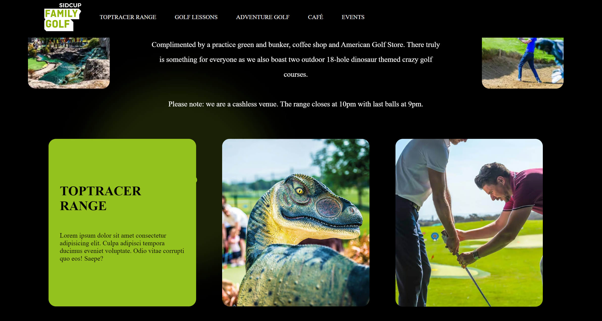
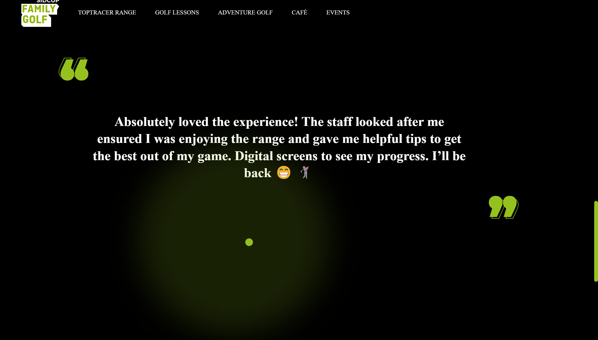

# Sidcup Family Golf Website

Welcome to the Sidcup Family Golf website! This README provides a brief overview of the structure and features of the website.

## Table of Contents

1. [About](#about)
2. [Navigation](#navigation)
3. [Main Sections](#main-sections)
4. [Styling](#styling)
5. [Script](#script)

## About

Sidcup Family Golf is a Toptracer driving range and crazy golf venue located in Sidcup, South East London. The website is designed to showcase various aspects of the venue, including Toptracer Range, golf lessons, adventure golf, and more.

## Navigation

The navigation bar at the top of the page includes links to different sections of the website:
- TOPTRACER RANGE
- GOLF LESSONS
- ADVENTURE GOLF
- CAFÉ
- EVENTS

## Main Sections

### Page 1
- Features a welcoming message and an introduction to Sidcup Family Golf.
- A video playing effect in the background
- Includes an arrow icon that animates when hovered.

### Page 2
- Showcases a horizontal scroller with repeated navigation links.
- Provides information about the venue and features dinosaur-themed crazy golf courses.
- Tilted Animation on cards
- Scroll Trigger

 
 
 
 
 
 
 
 

### Page 3
- Displays customer testimonials with a quote design.
- Includes decorative colon icons.

### Page 4
- Highlights key sections with images and titles: TOPTRACER RANGE, GOLF LESSONS, ADVENTURE GOLF.

### Footer
- Presents information about the venue, including address and contact details.

## Styling

The website is styled using CSS with a black and green color scheme. It incorporates smooth scrolling effects and a custom cursor for an enhanced user experience.

## Script

The script.js file includes mouse tracking for a custom cursor, styling changes on hover for navigation elements, and GSAP animations for various sections of the website.

---
